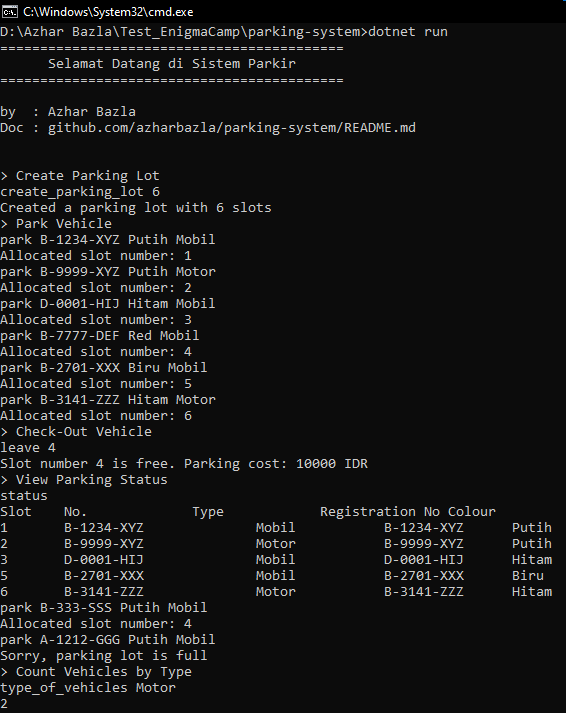
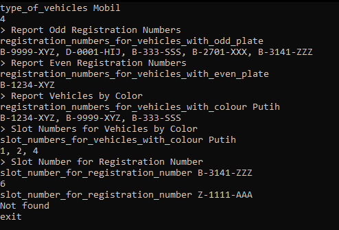

# Parking System

Parking System is a simple parking management application built using .NET 5. This system allows users to park vehicles, check out, and generate reports on the parking status. The application operates through a console interface without a graphical user interface.

## Key Features

- **Check-In**: Vehicles (Cars and Motorcycles) can enter and use the available lots.
- **Check-Out**: Vehicles can exit, and the parking slot will become available again.
- **Cost Calculation**: Parking fees are calculated on an hourly basis, with a minimum of 1 hour for each vehicle.
- **Reports**: Generate reports on the number of occupied lots, available lots, and vehicle counts based on type, odd/even registration numbers, and color.

## Project Structure
- ParkingSystem.csproj       (.NET 5 project file)  
- Program.cs                 (Main program containing console logic and user interaction)   
- Vehicle.cs                 (Class representing a vehicle)  
- ParkingLot.cs              (Class representing a parking lot)  
- ParkingSystem.cs           (Class managing the entire parking system (parking, reporting, etc.)  

## Installation
1. Clone this repository or download the source code.
2. Open the terminal and navigate to the project directory.
3. Run the following command to build and run the application:
   ```bash
   dotnet run

## How to Call Functions

Here’s how to call functions in this application:

### 1. Create Parking Lot
To create a parking lot, use the command: ```create_parking_lot <number_of_slots>```  
- **Example:**
    ```bash 
    create_parking_lot 6

### 2. Park Vehicle
To park a vehicle, use the command: ```park <registration_number> <color> <vehicle_type>```
- **Example:**
    ```bash
    park B-1234-XYZ White Mobil

### 3. Check-Out Vehicle
To check out a vehicle from a specific slot, use the command: ```leave <slot_number>```
- **Example:**
  ```bash
  leave 4

### 4. View Parking Status
To see the parking status, use the command: ```status```
### 5. Count Vehicles by Type
To count vehicles by type, use the command: ```type_of_vehicles <vehicle_type>```
- **Example:**
  ```bash
  type_of_vehicles Mobil
  
### 6. Report Odd Registration Numbers
To list vehicles with odd registration numbers, use the command: ```registration_numbers_for_vehicles_with_odd_plate```
### 7. Report Even Registration Numbers
To list vehicles with even registration numbers, use the command: ```registration_numbers_for_vehicles_with_even_plate```
### 8. Report Vehicles by Color
To list registration numbers of vehicles by a specific color, use the command: ```registration_numbers_for_vehicles_with_colour <color>```
- **Example:**
  ```bash
  registration_numbers_for_vehicles_with_colour Putih

### 9. Slot Numbers for Vehicles by Color
To see slot numbers of vehicles by a specific color, use the command: ```slot_numbers_for_vehicles_with_colour <color>```
- **Example:**
  ```bash
  slot_numbers_for_vehicles_with_colour Putih

### 10. Slot Number for Registration Number
To find the slot number for a specific registration number, use the command: ```slot_number_for_registration_number <registration_number>```
- **Example:**
  ```bash
  slot_number_for_registration_number B-3141-ZZZ

### 11. Exit the Program
To exit the application, use the command: ```exit```

## Screenshots of the Application

  
*Figure 1: Screenshot of the Parking System Application (Command Prompt)*

  
*Figure 2: Another Screenshot of the Parking System Application (Command Prompt)*